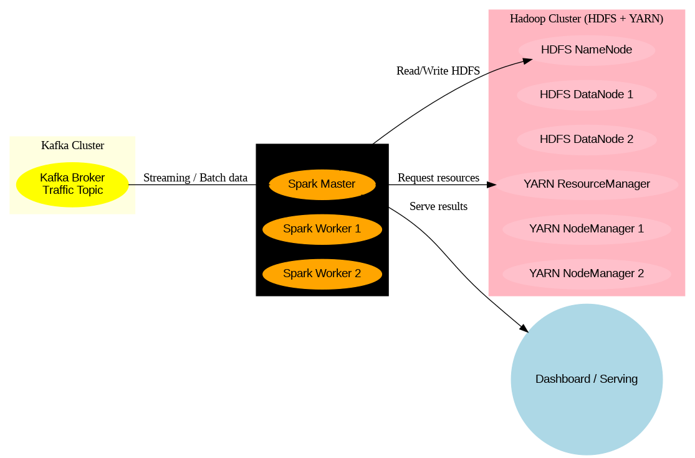

<h1 >ANALYSE DE TRAFFIC EN TEMPS-REEL </h1>

<h2>Description du projet</h2>
<p>
L'objectif de ce projet est de concevoir un système capable de taiter les données  générées par le trafic routier  de la ville de Casablanca (Maroc) afin de  surveiller  la congestion  de faire une analyse préictive du traf0ic routier de la ville en temps. Pour  ce faire, le système doit nous permettre de visualiser   des indicateur  comme :  
- La congestion moyenne de la ville.
- Les points critiques en termes d'embouteillage,
- Et les zones critiques.
Pour cela, nous aurons un dashboard  temps-rél    avec des charts, des map et d'autres indicateurs jugés pertinents. Dans ce projet, nous utiliserons des flux de trafic en direct ainsi que l'historique des données, ce qui pourra aider à prédire les embouteillages et à recommander des itinéraires alternatifs comme  comme  fonctionnlités avancées de notre système. L'utilisation efficace de ces données pourra même aider la ville à planifier la modernisation de ses infrastructures.
</p>


<h2>Architecture</h2>
Nous  allons implémenter une architecture classique  Lambda avec deux couches essentielles au niveau du **Data processing** que sont la couche  : Speed(traitement temps-réel) et la  couche  long-terme ( pour le bacth processing)

1. couche d'ingestion : 
Une API  pour nous fournir les données (l'API TomTom pour sa gratuité)
2. couche de traitement :
- Spark streming : pour la couche speed:
- spark MLlib
3. couche de stockage :  Apache Hadoop pour le data lake 
<h3>Architecture  du système </h3>

.png)



<h2>Implémentation</h2>

- <h3>Data source</h3> :
<p>
Notre projet va se raprocher d'un projet réel grâlce à l'utilisation de l'API de TomTom qui est totole gratuite et qui nous permet d'avoir les donnée réel de la circulation. Malgé le fait qu'il y a une limitation journalière, nous allons  ( 2500 requêtes par jour) cela suffit pour  avoir les information de  quelque axes routier de Casablanca dans un intervalle de temps raisonnable  pour  de façon continue. Pour cela, nous allons créer un compte   afin de créer une API KEY.
</p>

- <h3>La couche Ingestion</h3> : 
<p>
 Pour  implémenter cette couche, nous allons utiliser  utilise script python qui joue le rôle de suplier en recupérer les  données de  l'API TomTom et les envoit  vers un topic Kafka.

 Pour obtenir les  données , nous allons utiliser la stratégie **Bounding Box**  qui permet d'avoir les   données  de l'ensembles des avenues  se trouvant à l'interieur d'une zone géographique plutôt d'otenir les données     relatives a une seule routes. Pour
 les texte nous allons pas proceder exactement comme  nous l'avons décrit car nous sont  limité par la contrainte de requête jounalière qui est de 2500. A la place , nous allons   fournir la liste des axe princiaux : c'est l'approche **multi-point**
</p>

- <h3>La Couche de traitement </h3>
<p>
 Pour cette couche  qui constitue le cerveau du projet , nous consommons les données et  faisait les traitement  notament des transformations de d'aggrégation , d'analyse  prédictive, et d'entrainnement de  Machine machine learning. 
  -  Nous faisons de simplemet agregation.
  - Nous Faisons  tourner un modèle de machine learning qui apprend en ligne : il s'aagit d'une time serie que nous analysons en tenant compte de la date des évenement vu la pertinence de cette dernier sur la congestion. Ainsi, nous  assurons la ciclicité en utilisant un encodage avec les fonction $cos$ et $sin$. 
  - Nous faisons une modelisation du reséaux routier pour tenir compte du fait que la congestion se propage , pour un meilleur sortie de note modele.
 
 </p>
- <h3>La Couche de serving  </h3>
<p>
C'est ici que nous avons l'affichage  de nos differents  resultats du taitement pour cela nous utilions streamlit, et les bibliothèques comme, ploty.express et  pydeck de Uber pour le graphique.


<p>

<h2>Comment executer ce projet?</h2>
<p>
1. Tout d'abord avoir un  compte  sur la plateform TomTom pour   pour pouvoir créer une cle API

2. Nous avons déployer  le sytème en utilisant docker:
- Nous disposons donc d'un fichier [docker-compose.yml](./docker-compose.yml) et ce fichier contient le broker kafka, le cluster de spark en mode standalone , le cluster de HDFS et  un conteneur   que nous avons construit([conteneur Dockerfile](./serving/Dockerfile)) pour la visualisation. 
- Nous avons defini deux fichier d'environnement pour les variables d'environnements qui sont nécessaire pour la configuration de  [kafka](./kafka.env) et [hadoop](./hadoop.env) : pour plus d'info sur la config de ces    conteneur voir la documentation officielle.

- Pour lancer le conteneur on éxecute la commande : 

```bash
docker-compose up -d
```

Après la création des conteneurs , on peut créer les  topics suivant  en se connectant au broker.

```bash

docker exec -it broker1 bash

cd /opt/kafka/bin

 ./kafka-topics.sh --create --topic input-topic --bootstrap-server localhost:9092 --partitions 1 --replication-factor 1

 ./kafka-topics.sh --create --topic traffic-serving --bootstrap-server localhost:9092 --partitions 1 --replication-factor 1

# permet de verifier si les  topics ont été creé effectivement.
 ./kafka-topics.sh --list --bootstrap-server localhost:9092 
```


En suite  puis exceter le  script python du [supplier](./ingesstion/suplier.py)

après la création d'un environnement virtuel et  l installation des  qui sont dans [requirment.txt](./requirement.txt)

```bash
python -m venv <nomde_environnement>

# activer l environnement

pip install -r requiment.txt

python ./ingestion/suplier.py

```
On commence ainsi par remplier notre topic avec les données   récuper depuis TomTom.
If  avoir  un fichier d'environnement à la racine du projet où  nous allons définir les  variablre suivante:

```bash
API_KEY =  # la cle api copieé sur TomTom
KAFKA_SERVER = "localhost:9094" # pour contacter kafka depuis la machine
TOPIC_NAME = "traffic-data" 
TOPIC_OUTPUT ="traffic-serving" 
HDFS_OUTPUT_PATH="hdfs://namenode:8020/traffic" #   path hdfs
KAFKA_SERVER_ADDR_INT = "broker1:9092" # Nom du conteneur Broker

```
- Pour la partie spark nous allons faire une execution Standalone. Pour cela, nous avons deja fait un *binding  de volumes*  ce qui permet d'avoir tou non script dans le conteneur de sparkmaster. 
 Nous telechargeaons les dependans manquante de spark qui permet de    se conneter à kafka :

  - commons-pool2-2.12.0.jar
  - kafka-clients-3.7.0.jar
  - spark-token-provider-kafka-0-10_2.13-4.0.0.jar

Ce sont les versions conmpatible avec Spark 4. En cas de ploblème  se servir du repository maven pour avoir la version compatible  au cas où vous n'avez pas la version 4 de spark.

on peut alors laser  script via la commade :

```bash

./spark-submit   --master spark://spark-master:7077   --conf "spark.driver.userClassPathFirst=true"   --conf "spark.executor.userClassPathFirst=true"   --jars /opt/spark/jars/spark-sql-kafka-0-10_2.13-4.0.0.jar,/opt/spark/jars/kafka-clients-3.7.0.jar,/opt/spark/jars/commons-pool2-2.12.0.jar,/opt/spark/jars/spark-token-provider-kafka-0-10_2.13-4.0.0.jar   /opt/spark/work-dir/speed_layer/traffic_analiyser.p

```

On peut alors voir des  KPI sur l'intaface streamlit via le navigateur : [http://localhost:8051]
===================================================
================================================
# Valeur ajouter :  
Patie de l 'analyse predictive : 

je vais   tenir compte de deux aspect que sont un aspect   machine leaning d 'une serie temporelle en utilisant un algo de boosting , mais avant sans on doit considerer la nature du graph du donnée que nous  avons :
- 

et la modelisation du trafic routier comme   un graphe avec les carrefour comme  noeud et les  arret sont le   route ainsi. 

pour ça , on va commencer par la modélisation du graphe :

Kafka → Lagging → Injection voisinage → VectorAssembler → SGD.trainOn()
- on recoit les donné depuis kafka 
- lagging  : Le lagging consiste à ajouter les valeurs du passé comme nouvelles colonnes dans ton dataset. ( trois colone  de plsus t-1,t-2,t-3)
-  Injection de voisinage 
- on assembler  et fait l entrainemment :

- l entrainement 

==========================

C'est une excellente transition. Pour Casablanca, combiner la puissance tabulaire (GBT) avec la structure graphe (GNN) est l'approche "State-of-the-Art". On ne prédit plus seulement une valeur isolée, on prédit la vague de congestion qui se déplace dans la ville.

Voici comment structurer cette double approche dans ton pipeline :
1. Volet Tabulaire : Préparation du "Lagging" avec Spark

Le GBTRegressor ne comprend pas le temps par lui-même. Tu dois lui donner le passé sous forme de colonnes.

La logique à implémenter :
Pour chaque avenue, tu vas utiliser des Window Spark pour regarder les 3 derniers messages (T-1, T-2, T-3).

    Pourquoi ? Cela permet au modèle de voir si la vitesse est en train de chuter (accélération négative).

2. Volet Graphe : Modéliser le réseau avec GraphX

C'est ici que tu définis que l'Avenue des FAR touche le Boulevard Zerktouni.

    Noeuds (Nodes) : Tes intersections ou tes segments d'avenues.

    Liens (Edges) : La connectivité physique. Si l'Avenue A se jette dans l'Avenue B, il y a un lien.

L'astuce pour ton Dashboard :
Tu peux utiliser GraphX pour calculer le PageRank des rues. Une rue avec un PageRank élevé est une "artère vitale". Si elle bloque, toute la ville bloque.
3. Le Saint Graal : STGCN (Spatio-Temporal GCN)

Le STGCN combine les deux mondes :

    Spatial : Les convolutions sur graphe capturent la structure de la ville (voisins proches).

    Temporel : Les couches de convolution temporelle capturent l'évolution des vitesses.

Comment l'intégrer à ton Dashboard ?
Comme le STGCN est souvent complexe à entraîner en streaming pur sur Spark, l'astuce consiste à :

    Entraîner le modèle en Batch (sur tes données historiques).

    Sauvegarder le modèle au format ONNX ou TensorFlow.

    Utiliser Spark pour faire l'inférence (la prédiction) en temps réel sur le flux Kafka.

4. Visualisation du futur sur ta Map

Pour "deviner" les retards sur Pydeck, tu vas ajouter une deuxième couche de colonnes, ou changer la couleur des colonnes actuelles en "prédiction".

    Colonnes pleines : Trafic actuel.

    Colonnes "fantômes" (translucides) : Trafic prédit dans 15 minutes.

Le code Pydeck pour la prédiction :
Prochaine étape :

Pour commencer, il nous faut définir la matrice d'adjacence (quelles rues se touchent).

Veux-tu que nous écrivions le script Spark pour créer les colonnes de "Lagging" (T-1, T-2) afin d'améliorer ton modèle GBT actuel ?